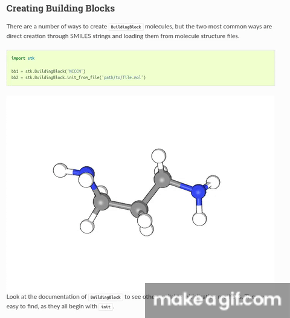
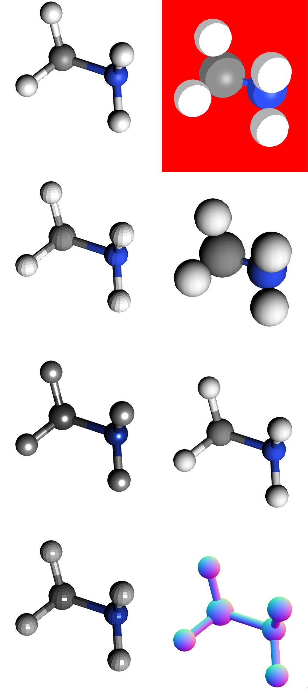

:author: Lukas Turcani

Introduction
============

``moldoc`` is a Sphinx extension for making better chemistry
documentation. It allows you to embed 3D, interactive models of
molecules directly into your compiled docs. You can see it being used
in the stk__ docs.

.. __: https://stk.readthedocs.io/en/stable/basic_examples.html

Installation
============

First, run

.. code-block:: bash

    pip install moldoc

and then add it to your extensions in ``conf.py``

.. code-block:: python

    extensions = [
        'moldoc',
    ]

Adding Molecules into Your Docs
===============================

You can define molecules you show with the ``moldoc`` directive,
which you  can place it into your ``rst`` files

.. code-block:: rst

    .. moldoc::

        # The content of a moldoc directive is just a Python script
        # which needs to define a moldoc_display_molecule variable.

        import moldoc.molecule as molecule

        moldoc_display_molecule = molecule.Molecule(
            atoms=(
                # molecule.Atom(atomic_number, position)
                molecule.Atom(6, (-0.06, -0.17, 0.)),
                molecule.Atom(17, (-1.35, 1.04, -0.04)),
                molecule.Atom(35, (1.65, 0.73, -0.06)),
                molecule.Atom(1, (-0.15, -0.88, -0.87)),
                molecule.Atom(1, (-0.09, -0.72, 0.97)),
            ),
            bonds=(
                # molecule.Bond(atom1_id, atom2_id, order)
                molecule.Bond(0, 1, 1),
                molecule.Bond(0, 2, 1),
                molecule.Bond(0, 3, 1),
                molecule.Bond(0, 4, 1),
            ),
        )

or in your Python docstrings

.. code-block:: python

    def some_fn():
        """
        Do something.

        .. moldoc::

            # The content of a moldoc directive is just a Python script
            # which needs to define a moldoc_display_molecule variable.

            import moldoc.molecule as molecule

            moldoc_display_molecule = molecule.Molecule(
                atoms=(
                    # molecule.Atom(atomic_number, position)
                    molecule.Atom(6, (-0.06, -0.17, 0.)),
                    molecule.Atom(17, (-1.35, 1.04, -0.04)),
                    molecule.Atom(35, (1.65, 0.73, -0.06)),
                    molecule.Atom(1, (-0.15, -0.88, -0.87)),
                    molecule.Atom(1, (-0.09, -0.72, 0.97)),
                ),
                bonds=(
                    # molecule.Bond(atom1_id, atom2_id, order)
                    molecule.Bond(0, 1, 1),
                    molecule.Bond(0, 2, 1),
                    molecule.Bond(0, 3, 1),
                    molecule.Bond(0, 4, 1),
                ),
            )

        """

        print('In some_fn()')

Note that the content in the ``moldoc`` directive is a just a Python
script, which has to define a ``moldoc_display_molecule`` variable
holding a ``moldoc.molecule.Molecule`` instance.

Because the content of a ``moldoc`` directive is just a Python script
you can define your molecules programatically

.. code-block:: python

    def some_fn():
        """
        Do something.

        .. moldoc::

            # The content of a moldoc directive is just a Python script
            # which needs to define a moldoc_display_molecule variable.

            import moldoc.molecule as molecule

            atoms = [molecule.Atom(6, (i, 0., 0.)) for i in range(10)]
            bonds = [molecule.Bond(i-1, i, 1) for i in range(1, 10)]

            moldoc_display_molecule = molecule.Molecule(
                atoms=atoms,
                bonds=bonds,
            )

        """

        print('In some_fn()')

Configuration
=============

The display of molecules is pretty configurable, here is a snapshot of
the different configuration options you have, but note that this is
not an exhaustive list

Configuration happens on both the molecule and the atom level. For
example

.. code-block:: rst

    .. moldoc::

        # The content of a moldoc directive is just a Python script
        # which needs to define a moldoc_display_molecule variable.

        import moldoc.molecule as molecule

        atoms = [
            molecule.Atom(
                atomic_number=6,
                position=(i, 0., 0.),
                # Configure the atom size and color.
                config=molecule.AtomConfig(
                    color=molecule.Color(
                        red=255,
                        green=0,
                        blue=0,
                    ),
                    size=1.2,
                ),
            ) for i in range(10),
        ]
        bonds = [molecule.Bond(i-1, i, 1) for i in range(1, 10)]

        moldoc_display_molecule = molecule.Molecule(
            atoms=atoms,
            bonds=bonds,
            config=molecule.MoleculeConfig(
                atom_scale=1,
                material=molecule.MeshStandardMaterial(),
                background_color=molecule.Color(0, 255, 0),
                is_outlined=False,
            ),
        )

Note that there are many materials to choose from, and that each has
its own set of configuration options. You can see the materials and
their configuration options in ``src/moldoc/molecule.py``. Note that
the materials correspond to classes in ``THREE.js``, for example
https://threejs.org/docs/#api/en/materials/MeshStandardMaterial, so
if you wish to understand the configuration options of each material
the ``THREE.js`` docs are the place to look. Most should be
straighforward to understand from the name however.
