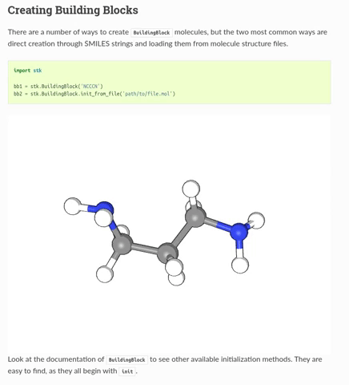

:author: Lukas Turcani

Introduction
============

``moldoc`` is a Sphinx extension for making better chemistry
documentation. It allows you to embed 3D, interactive models of
molecules directly into your compiled docs. You can see it being used
it in use in the stk__ docs.



.. __: https://stk.readthedocs.io/en/stable/basic_examples.html


Installation
============

First, run

```bash

pip install moldoc

```

and then add it your extension in ``conf.py``

```python

extensions = [
    'moldoc',
]

```


Adding Molecules into Your Docs
===============================

You can define molecules you show with the ``moldoc`` directive,
which you  can place it into your ``rst`` files

```rst

.. moldoc::

    # The content of a moldoc directive is just a Python script
    # which needs to define a moldoc_display_molecule variable.

    import moldoc.molecule as molecule

    moldoc_display_molecule = molecule.Molecule(
        atoms=(
            # molecule.Atom(atomic_number, position)
            molecule.Atom(6, (-0.06, -0.17, 0.)),
            molecule.Atom(17, (-1.35, 1.04, -0.04)),
            molecule.Atom(35, (1.65, 0.73, -0.06)),
            molecule.Atom(1, (-0.15, -0.88, -0.87)),
            molecule.Atom(1, (-0.09, -0.72, 0.97)),
        ),
        bonds=(
            # molecule.Bond(atom1_id, atom2_id, order)
            molecule.Bond(0, 1, 1),
            molecule.Bond(0, 2, 1),
            molecule.Bond(0, 3, 1),
            molecule.Bond(0, 4, 1),
            molecule.Bond(0, 5, 1),
        ),
    )

```


or in your Python docstrings

```python

def some_fn():
    """
    Do something.

    .. moldoc::

        # The content of a moldoc directive is just a Python script
        # which needs to define a moldoc_display_molecule variable.

        import moldoc.molecule as molecule

        moldoc_display_molecule = molecule.Molecule(
            atoms=(
                # molecule.Atom(atomic_number, position)
                molecule.Atom(6, (-0.06, -0.17, 0.)),
                molecule.Atom(17, (-1.35, 1.04, -0.04)),
                molecule.Atom(35, (1.65, 0.73, -0.06)),
                molecule.Atom(1, (-0.15, -0.88, -0.87)),
                molecule.Atom(1, (-0.09, -0.72, 0.97)),
            ),
            bonds=(
                # molecule.Bond(atom1_id, atom2_id, order)
                molecule.Bond(0, 1, 1),
                molecule.Bond(0, 2, 1),
                molecule.Bond(0, 3, 1),
                molecule.Bond(0, 4, 1),
                molecule.Bond(0, 5, 1),
            ),
        )

    """

```

Note that the content in the ``moldoc`` directive is a just a Python
script, which has to define a ``moldoc_display_molecule`` variable
holding a ``moldoc.molecule.Molecule`` instance.
